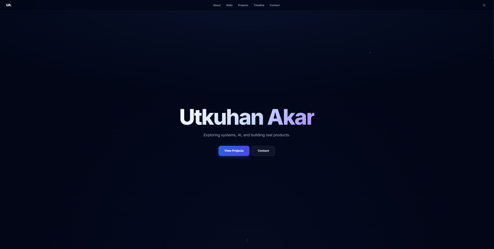
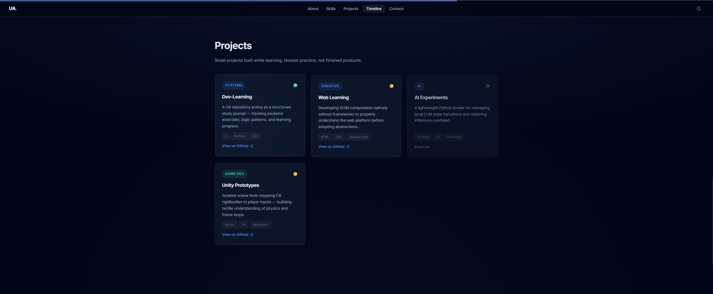
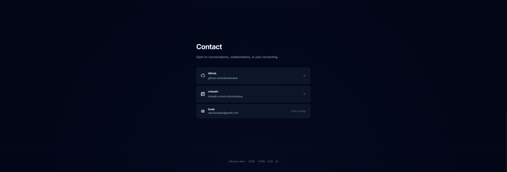

# Portfolio

A personal portfolio website focused on clean UI, systems thinking, and real project development.

---

## 🚧 Status

This project is currently under development.

The current version represents an active build phase — structure and design are being refined.

---

## 🎯 Goal

* Build a clean and minimal portfolio
* Focus on usability and clarity
* Avoid unnecessary complexity
* Improve step by step

---

## 🧠 Approach

Instead of trying to build everything at once:

* Start simple
* Fix what breaks
* Improve gradually
* Document the process

---

## 🛠 Tech Stack

* HTML
* CSS
* JavaScript

No frameworks. No unnecessary dependencies.

---

## ⚠️ Current Issues

* Some UI interactions are not stable
* Layout still being refined
* Overengineering mistakes are being cleaned

---

## 📸 Screenshots

  
  

  
  

---

## 📈 Development Process

This project is part of a learning journey.

Not perfect. Not final.

Built by:

* testing
* breaking
* fixing

---

## 🤖 AI Usage

AI tools were used during development:

* ChatGPT
* Claude
* Gemini

Used for:

* guidance
* debugging
* ideas

All code is reviewed and adapted manually.

---

## 🔒 License

© 2026 Utkuhan Akar
All rights reserved.

This project and its source code are the intellectual property of Utkuhan Akar.

No permission is granted to copy, modify, distribute, or use any part of this code without explicit written consent. 

